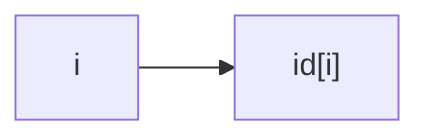
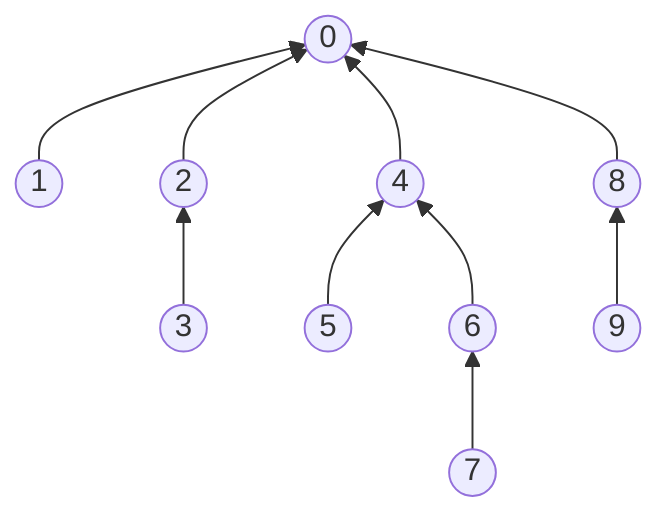

## 第一章是用 union find 做例子来讲述如何解决问题。

人在人的世界所面临的问题是庞大而多变的。我们希望利用电脑的优点来帮助人类解决人类世界的问题，
那么就需要迈过人的世界和电脑的世界之间的鸿沟。

通路问题，如果我们把所有互相联通的区域看做是一个点，并给这个点命名一个id, 那么对于图上每一个点，都可以构成一个属性对： { 点的名称 ： 所属id }。那么我们可以从两个方向上来实现这个数据结构：
 1. 从点的方向：
      {点A : id = 0} { 点B : id = 1}...
 2. 从id 的方向：
      id= 0 ： {A， B， C}
      id= 1 ： {D， E， F， G} ...

利用最常见的数组的形式，我们就可以实现从点的方向来组织所有数据。 而用集合的概念，我们也可以从id 的方向来组织数据。

#### 先用简单的算法来保证 解决方案是正确的，是寻找完美解决方案的基础。

先看从点的方向的简单解决方法。

```c
#ifdef __STDC_ALLOC_LIB__
#define __STDC_WANT_LIB_EXT2__ 1
#else
#define _POSIX_C_SOURCE 200809L
#endif

#include <stdio.h>
#include <stdlib.h>

#define N 10000
int id[N];

void union_s(int node1, int node2) {
    /* to simplify, change all nodes having id = v to id = t */
    int t = id[node1], v;

    if ( id[node1] != id[node2]) {
        v = id[node2];
        for (size_t i = 0; i < N; i++)
            if( id[i] == v ) id[i] = t;
    }
}

int find(int node) {
    return id[node];
}

int main( void )
{
    char *buf[1024];
    size_t len = 1024;

    int p, q, t, v, id[N];
    for (size_t i = 0; i < N; i++) id[i] = i;

    while (getline(buf, &len, stdin) > 1 ) {
        sscanf(*buf, "%d %d", &p, &q);

        union_s(p, q);

        for ( size_t i = 0; i < N; i++ )
            if (id[i] == t) printf("%ld - ", i);
        printf("\n");
    }
}

```
注：因为 union 是 C 语言的关键字，所以 我们用 union_s 代替。

而运行书中的 1-1 的例子的结果如下：

```bash
3 4
3 - 4 -
4 9
3 - 4 - 9 -
8 0
0 - 8 -
2 3
2 - 3 - 4 - 9 -
5 6
5 - 6 -
2 9
2 - 3 - 4 - 9 -
5 9
2 - 3 - 4 - 5 - 6 - 9 -
7 3
2 - 3 - 4 - 5 - 6 - 7 - 9 -
4 8
0 - 2 - 3 - 4 - 5 - 6 - 7 - 8 - 9 -
5 6
0 - 2 - 3 - 4 - 5 - 6 - 7 - 8 - 9 -
0 2
0 - 2 - 3 - 4 - 5 - 6 - 7 - 8 - 9 -
6 1
0 - 1 - 2 - 3 - 4 - 5 - 6 - 7 - 8 - 9 -

```
在数据录入部分，用源例程并不能很顺利的进入 while 循环。 gcc 8 之后的 scanf 并不好用，所以改用了 getline 函数。( 这样只需要回车一个空行就可以退出 while 循环。然后在输入过程中接收 backspace 可以修改输入错误)


整个算法可以分成两步：
   1. 对于图中的任何一条 edge, 都有两个端点；
   2. 如果两个端点的 id 不同，那么就把所有拥有 id1 或 id2 的 点都合并到一个id 下。这就是第一步：union。
   3. 找出点所属的id 并打印出来，就是第二步：find.


#### 下面开始优化步骤。

第一个解决方案的特点是可以正确地完成我们所需要的 objectives. 那么我们需要转向到 performance 的 concern。

如何比较两个方案的 performance?  既然需要比较，那么我们必须能 量化 这个 performance. 因为我们不能每次测试都设计 一亿个点 和 十亿条边来计算运行时间做出比较。 那么我们可以根据估算 整个算法运行所需要的 cycles 的量级和 总点数，总边数之间的数学关系，来比较算法的 performance.

首先我们看下第一个方案， 设 总共有 N 个 点， M 条边， 我们实际是对每一条边都 遍历了一次所有的点，所以可以表达为： $t = O(  M \times N )$. 

如果我们延续原有的思路，把整个算法分解成了两个部分，就是 union 和 find 两个部分，我们可以认为：

1. 对于 union 部分，我们需要 $t_1 = O(M \times N)$;
2. 对于 Find 部分，我们需要    $t_2 = O(1)$;
3. 所以根据加法原理，总的时间还是 $ t = O(M \times N)$.

既然时间的消耗主要花在遍历上，那么我们可以不用每次都遍历所有的点，只扫描必须要的点，这样就能减少所需要的单次运算了吧。



我们利用数组的序号和数据 可以抽象成为一种树的概念。因为我们只要有了序号，只需要一次运算就可以拿到 序号对应的数据。 基于这点，我们可以看下这个例子：

```
序号: 0 1 2 3 4 5 6 7 8 9
数据: 0 0 0 2 0 4 4 6 0 8
```



树是在人脑中的抽象，而数组则是电脑中的存在。利用树的概念，我们对应每一条边，只需要做 $O(1)$ 就可以把一个点搭进一个树结构中，也就是说，对于 union, $t_1 = O(1)$;

但是对于 Find 呢，我们不需要遍历全部的 N 个节点，我们只需要找到树的root, 就可以确定这个节点所在的集合。因为在一棵树里面，有且只有一个root。在上面的树里面， root 就是 0。所以，我们的 find 在平均的条件下，可以通过 $t2 = O(N/2)$ 就可以找到自己属于的 tree root.

那么总和起来，第二个解决方案的总时间是 $ t = O( \frac{M \times N}{2})$

```c
#ifdef __STDC_ALLOC_LIB__
#define __STDC_WANT_LIB_EXT2__ 1
#else
#define _POSIX_C_SOURCE 200809L
#endif

#include <stdio.h>
#include <stdlib.h>

#define N 10
int id[N];

void union_s( int node1, int node2 ) {
    int i = find(node1);
    int j = find(node2);
    if (i == j) return;
    id[i] = j;
}

int find( int node ) {
    /* In a tree, only the root = id[root]. so we use the empty
     * loop to find the root */
    for( int i = node; i != id[node]; i = id[node]);
    return i;
}

int main( void )
{
    char *buf[1024];
    size_t len = 1024;

    int p, q, t, v, id[N];
    for (size_t i = 0; i < N; i++) id[i] = i;

    while (getline(buf, &len, stdin) > 1 ) {
        sscanf(*buf, "%d %d", &p, &q);

        union_s(p, q);

        for ( size_t i = 0; i < N; i++ )
            printf("%d ", id[i]);
        printf("\n");
    }
}
```

其实这个方案还可以很快地求出从7 到 0 的最短路径。 就是 $ 7 \rightarrow 6 \rightarrow 4 \rightarrow 0$ . 那么 $ 7 \rightarrow 3$ 呢？

