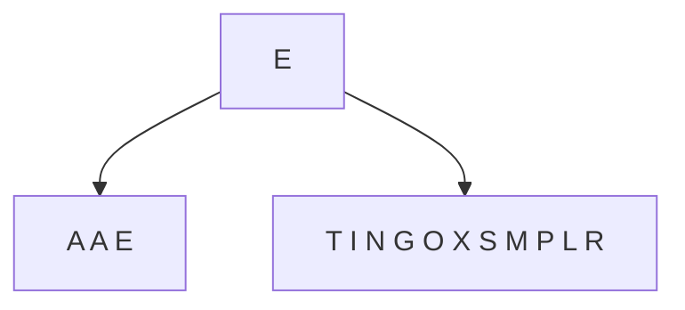
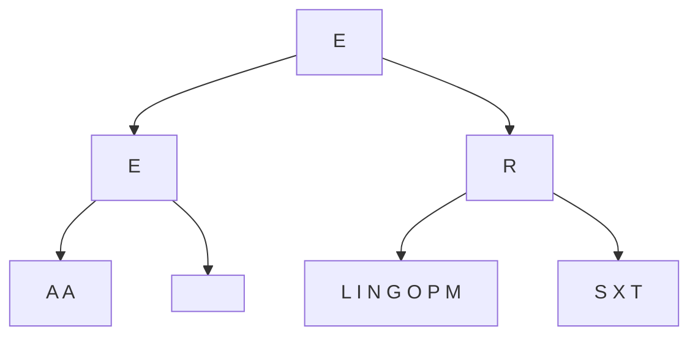

## quick sort 算法，实际等同于二叉查找树的概念.

```
A S O R T I N G E X A M P L E
```


以最后一个值为 root, 然后 在行列中找到一个位置，确保左边的所有值都小于等于 root, 右边所有值都大于 root;



然后分别对子树进行同样分割：




## size_t 的应用

在修改老师的原 code, 有一个问题就是 size_t 替换 int。

特点是 size_t = unsigned long, 这样 对于 size_t i = l - 1; 就不成立了。因为左 index 大部分情况下是 0, 而不可以把 -1 赋值给 size_t。

